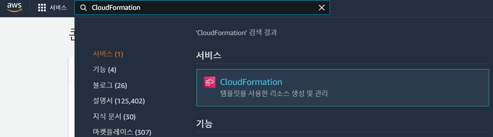
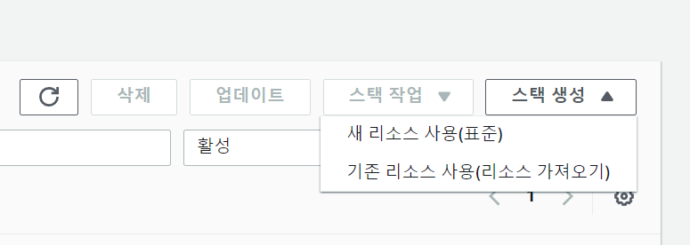
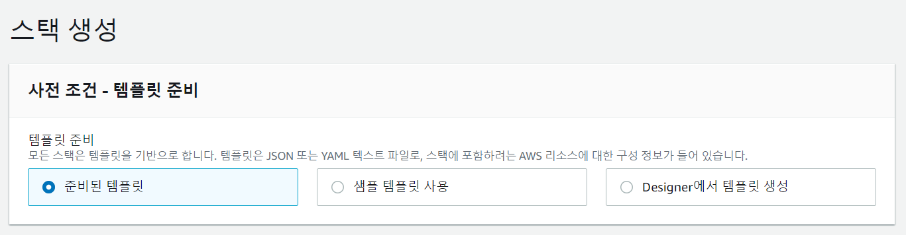
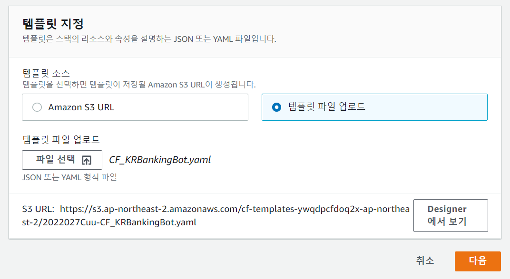
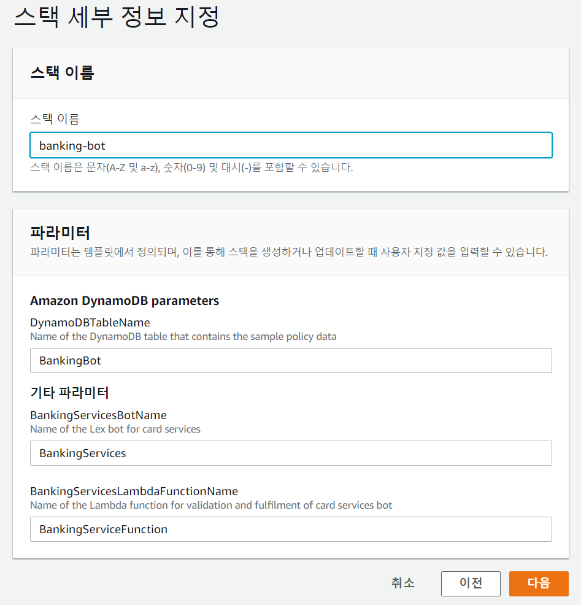
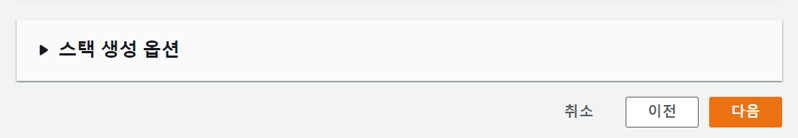
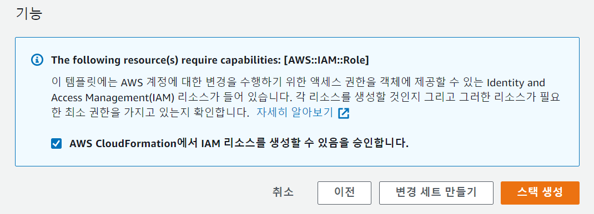

# Banking Bot 만들기

## 개요

앞서서는 Amazon Lex 콘솔만을 사용하여 간단한 HelloWorldBot을 만들어 보았습니다. 이번에는 AWS Lambda를 이용해 인터넷 뱅킹을 수행하는 좀 더 복잡한 작업을 하는 봇을 구현해 보겠습니다. 이번 섹션에서는 AWS CloudFormation을 사용하여 봇의 생성 및 구성을 자동화 하는 방법도 함께 살펴 보겠습니다.

## CloudFormation

AWS CloudFormation은 AWS 리소스 모음을 손쉽게 생성할 수 있는 클라우드 배포 자동화 서비스 입니다. CloudFormation을 사용하면 다음과 같은 이점이 있습니다.

- 인프라 관리 간소화: 리소스를 개별적으로 관리하는 대신 템플릿을 사용하여 필요할때마다 전체 스택을 한번에 생성, 업데이트, 삭제 할 수 있습니다.

- 신속한 인프라 복제: 애플리케이션의 가용성을 확보하기 위해서나 다양한 테스트를 위해서 환경을 복제하거나 여러 리전에 배포해야 하는경우 템플릿을 이용해 일관되고 반복적으로 리소스를 생성할 수 있습니다.

- 손쉬운 인프라 변경 사항 제어 및 추적: CloudFormation 템플릿을 AWS CodeCommit과 같은 버전관리 시스템을 이용해 관리할 수 있습니다. 이를 통해 과거로부터의 이력관리나 코드리뷰와 같은 작업들을 인프라에 대해서도 수행할 수 있습니다. 만약 업데이트한 새로운 버전의 환경에 문제가 있을경우 이전버전으로 되돌리는 작업도 간단하게 수행할 수 있습니다.

- 인프라 문서화 작업 간소화: CloudFormation 템플릿은 그 자체로 인프라 구성을 설명하고 있기 때문에 별도의 문서화 작업을 수행할 필요 없이 CloudFormation Designer와 같은 도구를 이용해 빠르고 정확하게 인프라의 구성을 살펴볼 수 있습니다. 또한 기존에 [만들어져 있는 리소스로부터 템플릿을 생성](https://docs.aws.amazon.com/AWSCloudFormation/latest/UserGuide/resource-import-new-stack.html)하거나 환경에 수동 변경등과 같은 작업으로 인해 [템플릿과 실제 환경에 차이가 생겼을 경우 이를 감지](https://docs.aws.amazon.com/ko_kr/AWSCloudFormation/latest/UserGuide/detect-drift-stack.html)하는 것과 같은 편리한 기능들을 제공합니다.

## CloudFormation 템플릿

이 워크샵에서는 미리 만들어진 CloudFormation 템플릿을 사용합니다. 아래 링크를 클릭하여 템플릿을 다운로드 하세요.

<a href="https://gonsoomoon-priviate-share.s3.ap-northeast-2.amazonaws.com/Lex-KR_BankingBot/CF-YAML-File/CF_KRBankingBot.yaml" download>다운로드</a>

다운로드한 파일을 손에 익은 텍스트 에디터로 열어서 내용을 살펴봅시다.

> CloudFormation 템플릿 구조에 익숙하지 않으신 분은 먼저 [사용 설명서](https://docs.aws.amazon.com/ko_kr/AWSCloudFormation/latest/UserGuide/template-anatomy.html)를 읽어 보시기 바랍니다.

이 템플릿은 Lambda 함수를 포함하여 Banking Bot을 프로비저닝하기 위한 내용이 기술되어 있습니다. 템플릿을 살펴보면 이전 섹션이 HelloWorldBot에서 생성한 것과 동일하게 발화 및 슬록으로 봇 구성을 정의한다는 것을 알 수 있습니다.

> [TBD] 봇 생성 시퀀스 추가

## 배포

이제 AWS CloudFormation 콘솔을 사용해서 Banking Bot을 배포해 봅시다.

먼저 AWS 콘솔 검색 표시줄에 CloudFormation을 입력하여 AWS Cloudformation 서비스로 이동합시다.

우측 상단의 **스택 생성** 버튼을 누른 후 **새 리소스 사용(표준)** 을 클릭합니다.

스택 생성 화면의 **사전 조건 - 템플릿 준비** 섹션에서 **템플릿 준비**는 준비된 템플릿을 선택합니다.

**템플릿 지정** 섹션에서 **템플릿 소스**는 **템플릿 파일 업로드**를 선택한 후에 **템플릿 파일 업로드**에서는 **파일 선택** 버튼을 클릭합니다. 파일 선택 다이얼로그 창이 뜨면 위에서 다운로드한 `CF_KRBankingBot.yaml`파일을 선택한 다음 **다음** 버튼을 클릭합니다.

**스택 세부 정보 지정** 화면에서 **스택 이름**에 `banking-bot`을 입력하고 나머지는 초기 설정 그대로 둔 채로 **다음** 버튼을 누릅니다.

**스택 옵션 구성**화면에서는 맨 아래로 내려가 **다음** 버튼을 클릭합니다.

banking-bot 검토 화면에서 맨 아래로 이동한 다음 **AWS CloudFormation에서 IAM 리소스를 생성할 수 있음을 승인합니다.** 앞의 체크 박스를 체크한 후에 **스택 생성** 버튼을 클릭합니다.

banking-bot 스택이 생성되고 있는 모습을 확인할 수 있습니다. 이 작업은 수 분이 소요됩니다.

