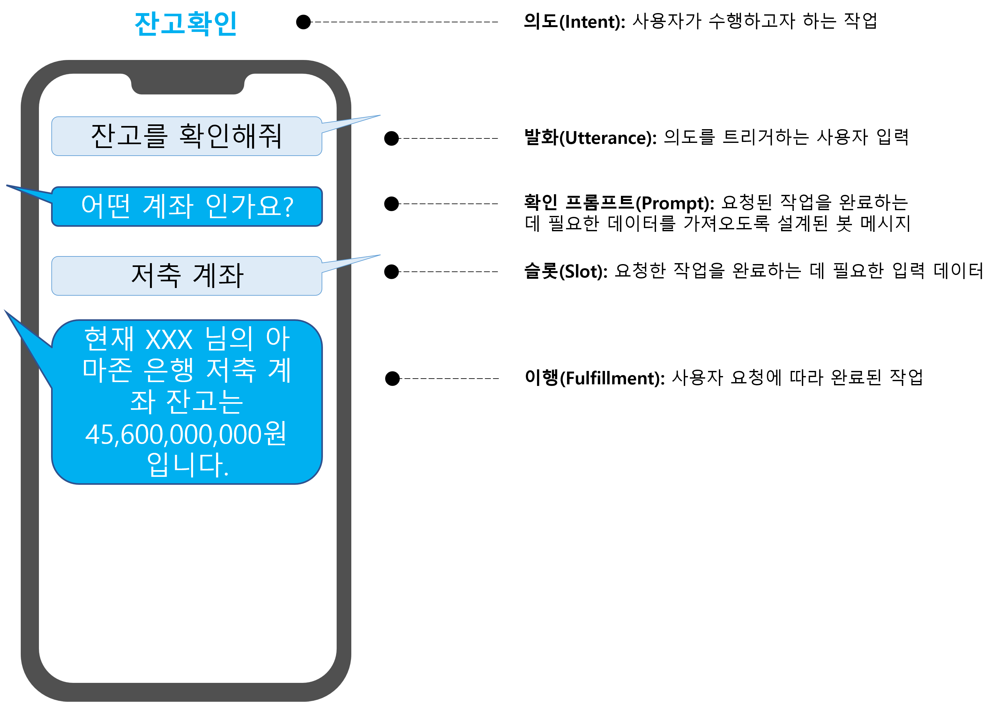
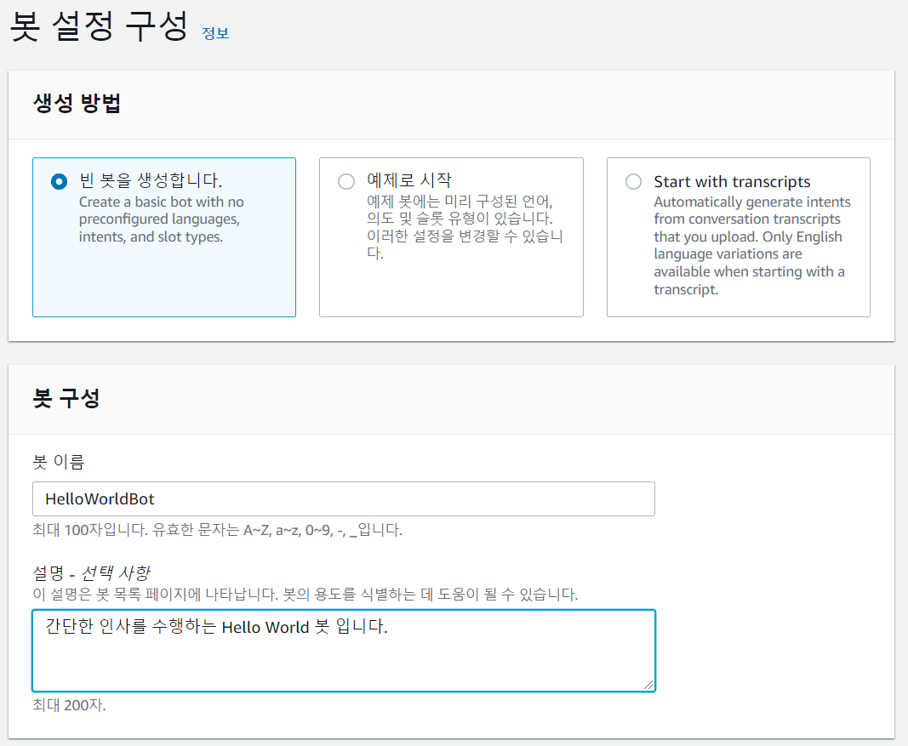
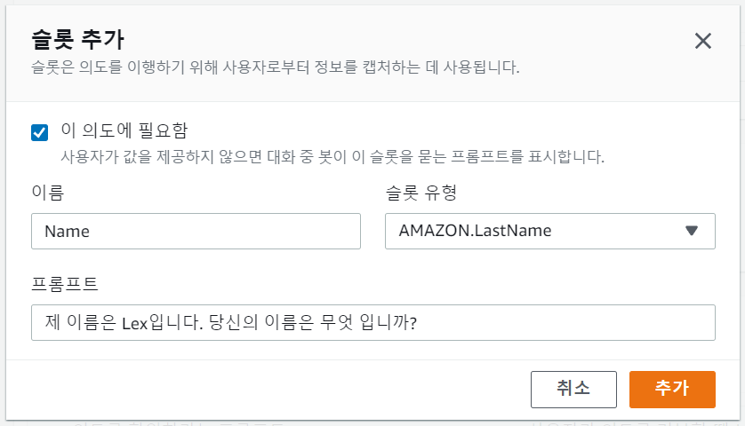

# Amazon Lex 한국어 뱅킹 챗봇 빌드 워크숍

Amazon Lex 한국어 뱅킹 챗봇 빌드 워크숍에 오신것을 환영합니다!

이 워크숍은 여러분이 Amazon Lex를 이용해 한국어로 동작하는 챗봇을 만들기 위해 필요한 지식들을 빠르게 익힐 수 있도록 구성되었 습니다.

# Amazon Lex란?

Amazon Lex 는 음성 및 텍스트를 사용하여 모든 애플리케이션에 대화형 인터페이스를 구축하기 위한 서비스입니다. Amazon Lex는 음성을 텍스트로 변환하는 자동 음성 인식(ASR)과 텍스트의 의도를 인식하는 자연어 이해(NLU)의 고급 딥 러닝 기능을 제공하여 매우 매력적인 사용자 경험과 생생한 대화로 애플리케이션을 구축할 수 있도록 합니다. 상호 작용. Amazon Lex를 통해 이제 Amazon Alexa를 지원하는 동일한 딥 러닝 기술을 모든 개발자가 사용할 수 있으므로 정교한 자연어 대화형 봇을 빠르고 쉽게 구축할 수 있습니다.

완전 관리형 서비스인 Amazon Lex는 자동으로 확장되므로 인프라 관리에 대해 걱정할 필요가 없습니다.

## Lex V2 출시

2021년 1월 출시된 새로운 Amazon Lex V2 콘솔을 통해 봇을 더 쉽게 구축, 배포 및 관리할 수 있습니다. 이 워크숍에서는 Lex V2 콘솔을 이용해 Amazon Lex 콘솔 및 API를 사용하는 방법, 기본 봇 구축 개념, 간단한 봇을 생성하는 방법에 대해 배우게 됩니다.

새로운 Amazon Lex V2 콘솔 및 API에는 봇 빌드를 단순화하는 데 도움이 되는 여러 가지 새로운 기능이 도입되었습니다.

- 언제든지 봇에 새 언어를 추가하고 단일 리소스로 설계, 테스트 및 배포의 수명 주기를 통해 모든 언어를 관리할 수 있습니다. 새로운 콘솔 대시보드를 사용하면 다른 언어 간에 빠르게 이동하여 대화를 비교하고 구체화할 수 있습니다.
- Amazon Lex API는 의도 및 슬롯 유형이 특정 언어로 범위가 지정되는 단순화된 정보 아키텍처를 따릅니다. 인텐트 및 슬롯 유형과 같은 리소스의 버전을 개별적으로 지정할 필요가 없도록 버전 관리는 봇 수준에서 수행됩니다.
- Amazon Lex 콘솔은 봇 설계 프로세스를 보다 유연하게 제어하고 제어할 수 있는 추가 빌더 생산성 도구 및 기능을 제공합니다. 예를 들어, 이제 구성을 스크립트, 테스트 및 조정할 때 부분적으로 완료된 작업을 저장할 수 있습니다. 새로운 대화 흐름 섹션을 사용하여 각 의도에 대한 발화 및 슬롯 유형을 볼 수도 있습니다 .

## 이 워크숍의 목표 - 뱅킹 봇 구축

이 워크숍에서는 Amazon Lex의 특징을 직접 사용하면서 학습 하도록 설계 되었습니다. 이 워크숍에서는 다중 인텐트 및 Lambda를 이용한 처리 후크를 포함한 Lex의 핵심 기능을 이용해 뱅킹 봇을 구축합니다.

# 워크숍 준비

## AWS 계정 생성

이 실습을 진행하기 위해서는 관리자 권한(AdministratorAccess)을 가진 IAM 사용자가 필요합니다. AWS계정이 없거나 IAM사용자가 없을경우 아래 링크를 참고하여 계정을 만드시기 바랍니다.

- [AWS 가입하기](https://aws.amazon.com/ko/premiumsupport/knowledge-center/create-and-activate-aws-account/)
- [관리자 권한을 가진 IAM 사용자 만들기](https://docs.aws.amazon.com/ko_kr/systems-manager/latest/userguide/setup-create-admin-user.html)

## 봇 관련 용어 설명

1. 의도(Intent) - 사용자가 수행하려는 작업입니다. 이를 통해 봇은 사용자가 수행하려는 작업을 이해하고 분류할 수 있습니다. 단일 봇은 여러 개의 다른 의도를 포함할 수 있으므로 하나의 봇이 사용자의 서로 다르지만 가장 유사한 관련 요청을 처리할 수 있습니다.
1. 표현(Utterance) - 의도를 트리거하기 위해 사용자가 입력하거나 말해야 하는 내용의 텍스트 표현입니다. 하나의 인텐트에는 다양한 발언이 포함될 수 있으므로 사용자가 다양한 구문을 사용하여 봇을 트리거하고 발언과 함께 다양한 데이터 매개변수(또는 "슬롯")를 제공할 수 있습니다.
1. 프롬프트(Prompt) - Lex는 은행 계좌 번호나 항공편 예약 날짜를 요청할 때와 같이 대화의 여러 단계에 대해 다른 프롬프트를 정의할 수 있습니다. 또한 Lambda 함수에 의해 런타임에 재정의될 수 있습니다.
1. 슬롯(Slot) - 봇이 작업을 수행하기 위해 필요한 데이터 항목입니다. 예를 들어 항공편 예약 의도의 경우 출발지 공항, 도착지 공항, 비행 날짜, 비행 시간 및 예약 클래스에 대한 슬롯이 필요할 수 있습니다. Lex에는 많은 내장 슬롯 유형이 있지만 사용 사례에 맞게 사용자 정의 슬롯 유형을 자유롭게 생성할 수 있습니다.
1. 이행(Fulfillment) - 종료 메시지와 사용자에 대한 몇 가지 추가 정보가 있는 봇의 최종 출력 메세지 입니다. 예를 들어 항공편 예약의 경우 이행에는 사용자가 예약한 경로 및 항공편 번호에 대한 간략한 요약과 함께 항공편이 예약되었음을 확인할 수 있는 메시지가 출력됩니다.

---

# 뱅킹 봇 생성

## Amazon Lex 봇 구조 살펴보기

모든 Amazon Lex 봇은 다음의 구조를 따릅니다.

모든 봇은 만들때 반드시 한 개 이상의 언어를 선택해야 합니다. 언어를 선택한 후엔 봇에 의도, 표현, 슬롯 등을 설정하는 UI를 볼 수 있습니다.

위 구조에서도 볼 수 있듯이 의도, 표현, 슬롯은 언어별로 정의해야 합니다. 사용자 지정 슬롯에 사용되는 동의어는 언어마다 다르며 의도별로 필요한 표현의 수와 구조도 마찬가지 입니다.

## 봇 기본 구조 생성

봇이 실제로 무엇을 할 것인가를 정의하기 전에 먼저 기본 구조를 만들어야 합니다.

1. 앞서서 만든 관리자 권한 계정으로 AWS 콘솔에 로그인 합니다.
2. 화면 상단의 Unified Search 창에 `Lex`를 입력 한 다음 표시되는 서비스 목록에서 **Amazon Lex**를 선택합니다. 리전은 **서울**을 선택해 주시고 언어는 **한국어**를 선택해 주세요.

3. **봇 생성** 버튼을 클릭하여 봇 설정 구성 화면으로 이동합니다.

4. **빈 봇을 생성합니다**를 선택한 다음 **봇 이름**에 `BankingBot`을 **설명 - 선택사항**에 `인터넷 뱅킹을 위한 봇 입니다.`를 입력합니다.

5. IAM 권한 섹션에서는 런타임 역할에 **기본 Amazon Lex 권한으로 역할을 생성합니다.** 를 선택합니다. 이 옵션은 Amazon Lex가 다른 AWS서비스를 호출 할 수 있도록 하는 권한을 IAM 역할을 통해 제공합니다.

6. 이 봇은 COPPA와 관련이 없으므로 COPPA 설정 섹션에서 **아니오**를 선택합니다.

> 참고: 미국내 관련 법에 따라 미국에 기반을 둔 회사가 13세 이하 어린이를 대상으로 한 봇을 제공하고자 하는 경우 콘솔 또는 Amazon Lex API를 사용하여 childDirected필드를 true로 설정하여 봇이 어린이 온라인 개인정보 보호법(COPPA)의 적용을 받는다고 Amazon Lex에 알려야 합니다.

7. Amazon Lex는 설정된 시간 동안만 세션을 유지합니다. 사용자가 유휴 상태이고 이 시간 동안 입력을 제공하지 않으면 세션이 종료됩니다. 이 워크숍에서는 기본값인 **5분**을 사용합니다.

8. 이 워크숍에서는 태그를 사용하지 않으므로 **고급 설정** 섹션은 그대로 두고 맨 아래에 있는 **다음** 버튼을 눌러 봇 기본 구조 생성을 완료합니다.

## 봇에 언어 추가

이제 봇에서 사용할 언어를 추가합니다. 이 단계에서는 최소 한 개 이상의 언어를 선택 해야만 합니다. 현재 Amazon Lex는 한국어를 포함해 13개 언어를 지원합니다. Amazon Lex는 v2부터 동시에 여러 언어를 사용할 수 있도록 복수의 언어를 음성 상호 작용에 추가하는것이 가능합니다. 이 워크숍에서는 한국어를 사용하겠습니다.

1. 언어 선택 - 한국어(KR)을 선택합니다.

2. 음성 상호 작용 - 봇이 사용자와 상호 작용하는 데 사용하는 텍스트 투 스피치 음성입니다. 한국어의 경우 polly의 한국어 음성인 서연(Seoyeon)이 선택됩니다.

3. 의도 분류 신뢰도 점수 임계값 - 사용자가 발언을 하면 Amazon Lex는 자연어 이해(NLU)를 사용하여 사용자의 요청을 이해하고 적절한 의도를 반환합니다. 기본적으로 Amazon Lex는 봇이 정의한 가능성이 가장 높은 의도를 반환합니다.

> Amazon Lex가 반환하는 신뢰도 점수는 0부터 1사이의 숫자로 여러 의도를 비교하기 위한 상대 값 입니다. 이 값은 Amazon Lex가 개선됨에 따라 변경될 수 있습니다.

이제 봇의 기본 구조가 완성되었습니다. 다음단계에서는 본격적으로 봇을 구현해 보도록 하겠습니다.

---

# 뱅킹 봇 구현

지금부터 우리들은 잔고 확인, 자금 이체, 대출 가능여등의 몇 가지 기본적인 은행 업무 기능을 제공할 수 있는 뱅킹 챗봇을 만들려고 합니다.

## 첫 번째 의도 작성하기

이 섹션에서는 간단한 FallbackIntent와 함께 기본 Welcome인텐트를 설정한 후에 다음을 추가하여 기능을 추가해 나갈 것 입니다.

1. Custom Slot
2. Lambda Function
3. Context management

## 환영 의도 추가

Amazon Lex의 네비게이션 화면에서 봇
BankingBot
버전
버전: Draft
모든 언어
언어: 한국어(KR)
의도

- 의도(Intent) - 의도는 사용자가 수행하려는 작업을 나타냅니다. 하나 이상의 관련 인텐트를 지원하는 봇을 만듭니다. 예를 들어 피자와 음료를 주문하는 인텐트를 만들 수 있습니다. 각 의도에 대해 다음 필수 정보를 제공합니다.

  - 대화 흐름 - 대화 흐름을 사용하여 봇과 사용자 간의 대화를 시각화할 수 있습니다. 다른 대화 상자 노드를 선택하여 의도 내에서 탐색할 수 있습니다. 의도에 대한 확인 프롬프트 및 종료 응답 등의 다른 대화 상자 노드를 추가하면 흐름이 자동으로 생성됩니다.
  - 샘플 표현 - 이 의도를 호출하기 위해 사용자가 말하거나 입력할 것으로 예상되는 대표적인 구문입니다. Amazon Lex는 샘플과 다를 수 있는 사용자 입력을 해석하기 위해 샘플 표현을 기반으로 추정합니다. 샘플 표현의 우선순위는 의도 분류 출력을 결정하는 데 사용되지 않습니다.
  - 슬롯 - 봇이 의도를 이행하는 데 필요한 정보입니다. 봇이 아래 우선순위에 따라 의도 이행에 필요한 슬롯을 묻는 프롬프트를 표시합니다.
  - 슬롯 유형 - Lex는 도시나 나라 날짜, 숫자등을 입력받기 위한 슬롯을 기본으로 제공합니다. 기본으로 제공되는 슬롯 이외에 직접 [슬롯 유형을 추가](https://docs.aws.amazon.com/lexv2/latest/dg/build-slot-types.html)하는것도 가능합니다.
  - 확인 프롬프트 및 거부 응답 - 프롬프트는 의도를 확인하고자 할 때 이용합니다. 예를들어, 식사를 주문하는 봇을 만들었을때 확인 프롬프트에 "준문을 진행하시겠습니까?"라는 문장을 넣어 의도를 확인토록 할 수 있습니다. 사용자가 확인 프롬프트를 거부하는 경우 lex가 어떤 응답을 해야 하는지도 정할 수 있는데 이를 거부 응답이라고 합니다. 식사 주문을 예로 들자면 "주문을 진행하지 않고 종료합니다."와 같은 문장을 설정할 수 있습니다.
  - Fulfillment - Lambda 함수의 실행이 완료된 경우 사용자에게 이를 알리기 위해 설정합니다. 성공하였을 경우의 문구는 **On successful fulfillment**에 설정하고 실패하는 경우의 문구는 **In case of failure**에 설정합니다.

  - 응답을 닫는 중 - 의도를 닫을 때 lex가 사용자에게 보내는 응답을 정의할 수 있습니다.
  - 코드 후크
    - 초기화 및 검증에 Lambda 함수 사용 - Lambda 함수는 대화의 모든 전환에서 실행됩니다. 이 함수를 사용하여 값을 초기화하거나 사용자 입력을 검증할 수 있습니다.
